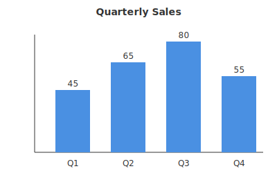
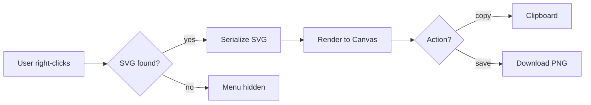
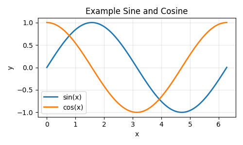

# SVG Export Extension - Examples

This document demonstrates the three types of graphics commonly found in
JupyterLab markdown files. The extension adds a right-click context menu
with "Copy as PNG" and "Save as PNG" options on the SVG and Mermaid
graphics below. The PNG image is included for comparison - it is not
convertible since it is already a raster image.

## 1. SVG graphic

A standalone SVG file referenced by URL. The extension fetches the SVG
content, resolves any `@media (prefers-color-scheme)` CSS based on the
current JupyterLab theme, and renders it at the configured DPI.

Right-click the chart above to export it as PNG.

## 2. Mermaid diagram

Inline Mermaid diagram rendered by JupyterLab. Mermaid diagrams are
rendered as inline SVG in the DOM, so the extension can export them
just like any other SVG.

Right-click the diagram above to export it as PNG.

## 3. PNG image

A regular raster image. The context menu does not show export options
for PNG images - there is nothing to convert since the image is already
a PNG.

Right-click this image - no SVG export options will appear.

## Summary

| Graphic type | Context menu | Notes                                |
| ------------ | ------------ | ------------------------------------ |
| SVG file     | shown        | Fetched, theme-resolved, rendered    |
| Mermaid      | shown        | Serialized from DOM, theme-resolved  |
| PNG image    | hidden       | Already raster, no conversion needed |
