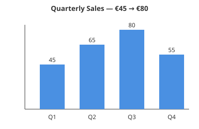
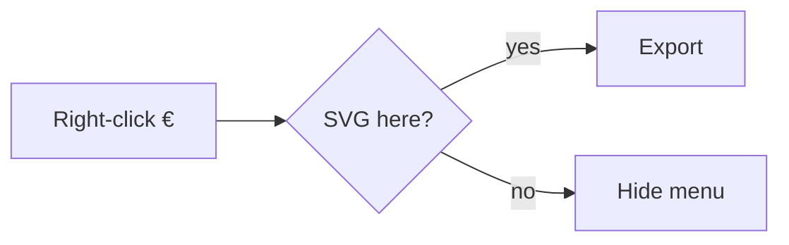
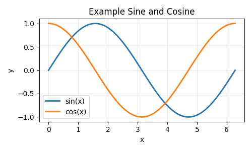

# Graphics fixture

This paragraph is plain body text with no graphic in it. Right-clicking it must
not offer the PNG export items, even though this document does contain two SVG
graphics further down.

## SVG file

## Mermaid diagram

## Raster image

A final paragraph, so the last block of the document is text rather than an
image.
